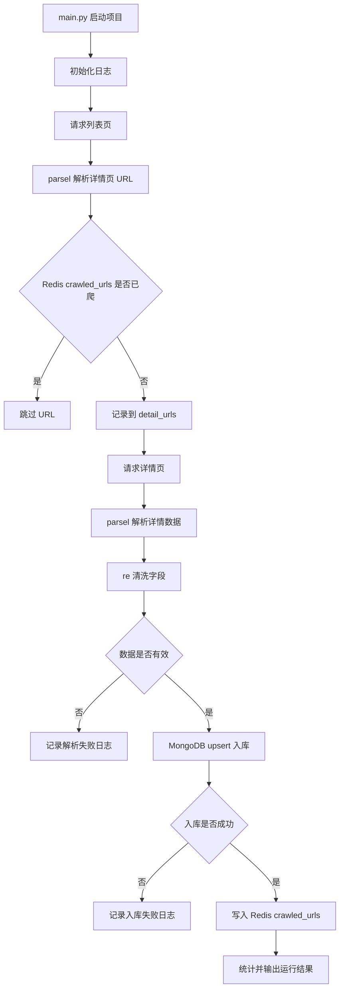
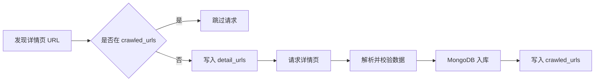

# SSR1 Movie Spider Pro

基于 Python 实现的 SSR1 电影数据采集项目，目标站点为 `https://ssr1.scrape.center/`。项目从单文件 demo 爬虫逐步升级为工程化爬虫，覆盖列表页采集、详情页采集、结构化解析、数据清洗、MongoDB 入库、Redis 去重、请求重试和日志记录。

## 项目简介

本项目用于采集 SSR1 电影站点中的电影详情数据。程序会自动遍历多页电影列表，提取详情页 URL，进入详情页解析电影名称、封面、分类、上映时间、评分和剧情简介，并将清洗后的结构化数据写入 MongoDB。

项目同时使用 Redis Set 记录已发现和已成功采集的详情页 URL，避免重复请求，降低重复入库概率。MongoDB 的唯一索引作为最后一道防线，保证同一个详情页不会产生重复文档。

## 技术栈

- `requests`：发送 HTTP 请求
- `parsel`：解析 HTML 页面结构
- `re`：清洗日期、评分和空白字符
- `MongoDB`：存储电影文档数据
- `Redis`：详情页 URL 去重
- `logging`：终端和文件日志记录

## 项目亮点

- 使用 `parsel` 替代正则进行结构化 HTML 解析
- 使用 Redis Set 实现详情页 URL 去重
- 使用 MongoDB 存储电影文档数据
- 使用唯一索引避免重复入库
- 加入日志、异常捕获和请求重试机制
- 代码按请求、解析、清洗、存储模块拆分
- 加入数据有效性校验，避免空数据入库后被标记为已爬

## 项目架构



## 数据字段

单条电影数据结构如下：

```json
{
  "url": "https://ssr1.scrape.center/detail/1",
  "name": "霸王别姬 - Farewell My Concubine",
  "cover": "https://p0.meituan.net/movie/example.jpg",
  "categories": ["剧情", "爱情"],
  "published_at": "1993-07-26",
  "score": 9.6,
  "drama": "影片围绕两位京剧伶人的半世纪悲欢离合展开。",
  "created_at": "2026-07-16 14:30:00",
  "updated_at": "2026-07-16 14:30:00"
}
```

字段说明：

| 字段 | 类型 | 说明 |
| --- | --- | --- |
| `url` | string | 电影详情页链接 |
| `name` | string | 电影名称 |
| `cover` | string | 封面图片链接 |
| `categories` | array | 电影分类 |
| `published_at` | string/null | 上映日期 |
| `score` | number/null | 电影评分 |
| `drama` | string | 剧情简介 |
| `created_at` | string | 首次采集时间 |
| `updated_at` | string | 最近更新时间 |

## MongoDB 数据示例

MongoDB 使用文档模型存储电影数据，一部电影对应一个 document，分类字段天然适合用数组存储。

默认连接配置在 `config.py` 中维护：

```python
MONGO_URI = "mongodb://127.0.0.1:27017"
MONGO_DATABASE = "scrape_center"
MONGO_COLLECTION = "ssr1_movie_details"
```

索引设计：

```text
url    唯一索引，防止重复入库
name   普通索引，方便按电影名查询
score  普通索引，方便按评分排序或统计
```

入库逻辑使用 `update_one(..., upsert=True)`：

```text
url 已存在：更新电影数据
url 不存在：插入新电影文档
```

常用查询示例：

```javascript
use scrape_center

db.ssr1_movie_details.findOne()

db.ssr1_movie_details.getIndexes()

db.ssr1_movie_details.find({ name: /肖申克/ })

db.ssr1_movie_details.find().sort({ score: -1 }).limit(10)
```

## Redis 去重设计

Redis 在本项目中主要用于请求前去重，减少重复请求和重复解析。MongoDB 唯一索引负责最终兜底，两者职责不同，可以同时存在。

Redis key 设计：

```text
ssr1:movie:detail_urls   记录发现过的详情页 URL
ssr1:movie:crawled_urls  记录已经成功请求、解析并入库的详情页 URL
```

去重流程：



常用 Redis 查看命令：

```redis
SCARD ssr1:movie:detail_urls
SCARD ssr1:movie:crawled_urls
SMEMBERS ssr1:movie:crawled_urls
```

## 项目结构

```text
ssr1_movie_regex__json__multiprograming/
├── README.md
├── requirements.txt
├── main.py
├── config.py
├── spider/
│   ├── __init__.py
│   ├── crawler.py
│   ├── parser.py
│   └── cleaner.py
├── storage/
│   ├── __init__.py
│   ├── mongo_storage.py
│   └── redis_storage.py
├── utils/
│   ├── __init__.py
│   └── logger.py
├── logs/
│   └── spider.log
└── results/
```

文件职责：

| 文件 | 职责 |
| --- | --- |
| `main.py` | 项目入口，编排列表页采集、详情页采集、校验、入库和统计 |
| `config.py` | 管理 URL、请求头、MongoDB、Redis、重试和间隔配置 |
| `spider/crawler.py` | 请求列表页和详情页，处理 timeout、重试、异常和状态码 |
| `spider/parser.py` | 使用 `parsel` 解析列表页 URL 和详情页字段 |
| `spider/cleaner.py` | 使用正则清洗文本、日期、评分和文件名 |
| `storage/mongo_storage.py` | MongoDB 连接、索引创建和 upsert 入库 |
| `storage/redis_storage.py` | Redis Set 去重和已爬标记 |
| `utils/logger.py` | 配置终端和文件日志 |

## 安装依赖

建议先创建虚拟环境，再安装依赖：

```bash
pip install -r requirements.txt
```

依赖内容：

```txt
requests
parsel
pymongo
redis
```

运行前需要本机或服务器已启动：

```text
MongoDB
Redis
```

## 运行方式

先根据本地环境检查 `config.py`：

```python
BASE_URL = "https://ssr1.scrape.center/"
TOTAL_PAGE = 10
TIMEOUT = 10
MAX_RETRY = 3
MIN_SLEEP = 0.5
MAX_SLEEP = 1.5
```

然后运行：

```bash
python main.py
```

运行过程中，日志会同时输出到终端和 `logs/spider.log`。

## 运行效果

运行日志示例：

```text
2026-07-16 14:30:01 - __main__ - INFO - ssr1 movie spider started
2026-07-16 14:30:02 - __main__ - INFO - start crawling index page: 1
2026-07-16 14:30:03 - __main__ - INFO - index page 1 extracted detail urls: 10
2026-07-16 14:30:05 - root - INFO - MongoDB insert success: 霸王别姬 - Farewell My Concubine
2026-07-16 14:30:05 - __main__ - INFO - movie saved successfully: 霸王别姬 - Farewell My Concubine
2026-07-16 14:30:05 - root - INFO - marked crawled: https://ssr1.scrape.center/detail/1
2026-07-16 14:35:00 - __main__ - INFO - ssr1 movie spider finished
2026-07-16 14:35:00 - __main__ - INFO - total detail urls extracted: 100
2026-07-16 14:35:00 - __main__ - INFO - skipped crawled urls: 0
2026-07-16 14:35:00 - __main__ - INFO - failed detail urls: 0
2026-07-16 14:35:00 - __main__ - INFO - parse failed items: 0
2026-07-16 14:35:00 - __main__ - INFO - saved items: 100
```

采集成功后，可以在 MongoDB 中看到电影文档，也可以在 Redis 中看到详情页 URL 去重集合。

## 后续优化方向

- 将 MongoDB、Redis 密码等敏感配置迁移到 `.env`
- 引入 `requests.Session` 复用连接
- 增加代理 IP、随机 User-Agent 和更完整的反爬策略
- 增加多线程或异步请求，提高采集效率
- 增加单元测试，覆盖解析、清洗和存储逻辑
- 增加失败 URL 重试队列，为 RabbitMQ 版本做准备
- 将旧版单文件代码移动到 `legacy/`，保持根目录更清爽
