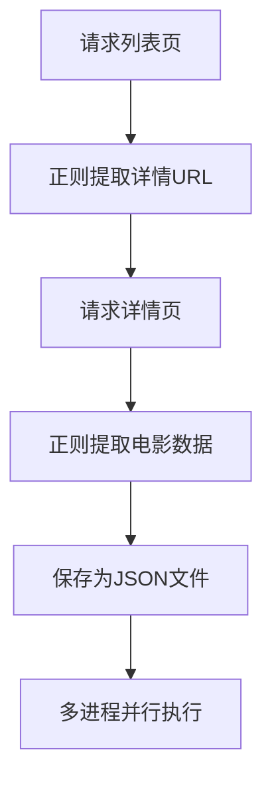

# Python 爬虫开发实战
基于 Python 实现的**静态网页爬虫项目**，实战目标站点：`https://ssr1.scrape.center/`，完整覆盖爬虫基础流程 + 性能优化，适合爬虫入门学习。

## 项目简介
本项目通过 **Requests + 正则表达式** 实现电影数据爬取，从单进程基础实现，优化为**多进程并行爬取**，大幅提升爬取效率，最终将电影信息结构化保存为 JSON 文件。

核心爬取数据：
- 电影封面、名称、分类
- 上映时间、豆瓣评分
- 剧情简介

## 项目结构
```
├── main.py          # 主爬虫文件（单进程/多进程实现）
├── results/         # 爬取结果保存目录（自动创建）
├── .gitignore       # Git忽略文件（隐藏文件）
└── README.md        # 项目说明文档

```

## 技术栈
- **请求库**：`requests`（发送 HTTP 请求）
- **解析方式**：正则表达式（提取 HTML 数据）
- **并发优化**：`multiprocessing`（多进程并行爬取）
- **数据存储**：JSON 文件（结构化保存）
- **辅助工具**：日志打印、URL 拼接、异常处理

## 快速开始
### 1. 环境准备
安装依赖库：
```bash
pip install requests
```

### 2. 运行项目
直接执行主文件：
```bash
python main.py
```

### 3. 查看结果
爬取完成后，所有电影数据会保存在 `results/` 目录下，以**电影名称**命名 JSON 文件。

## 核心功能
1. **自动分页爬取**
   自动遍历站点 1~10 页电影列表，提取所有电影详情页链接。

2. **结构化数据解析**
   通过正则精准提取封面、名称、分类、上映时间、评分、剧情简介。

3. **异常安全处理**
   捕获网络请求、数据解析异常，保证爬虫稳定运行，不中断。

4. **多进程性能优化**
   使用进程池并行爬取，相比单进程效率提升数倍。

5. **规范数据存储**
   自动创建结果目录，清洗文件名特殊字符，避免保存失败。

## 核心流程


## 学习要点
1. **Requests 库用法**：模拟浏览器请求，配置请求头，处理请求异常
2. **正则表达式**：`re.S` 匹配换行、分组提取数据、`search/findall` 区分
3. **URL 处理**：`urljoin` 拼接相对路径为完整 URL
4. **多进程**：`multiprocessing.Pool` 进程池实现并行爬取
5. **实战规范**：日志记录、文件命名清洗、异常捕获

## 注意事项
1. 爬取前请确认目标站点**允许爬取**，遵守 `robots.txt` 协议
2. 可添加随机延时 `time.sleep()` 降低请求频率，避免被反爬限制
3. 正则表达式适配当前页面结构，页面更新后需同步调整匹配规则

## 扩展优化方向
1. 替换解析库：使用 `BeautifulSoup4`/`lxml` 替代正则，更易维护
2. 反爬升级：添加随机 User-Agent、代理 IP 池
3. 存储升级：将数据保存到 MySQL/Excel 等持久化存储
4. 并发升级：学习多线程、异步爬虫（`aiohttp`）